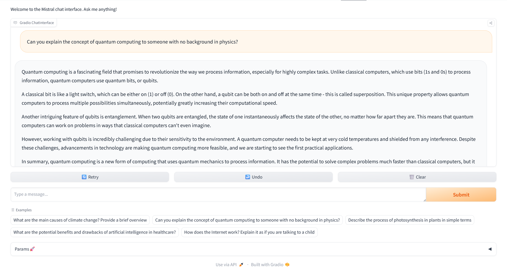

🚀Check out the configuration reference at https://huggingface.co/docs/hub/spaces-config-reference

🚀Huggingface Spaces : https://huggingface.co/spaces/prithivMLmods/Mistral-7B-v0.3-Chatbot

🚀Docs for Space : 

    # Make sure you have git-lfs installed (https://git-lfs.com)
    git lfs install
    
    git clone https://huggingface.co/spaces/prithivMLmods/Mistral-7B-v0.3-Chatbot
    
    # If you want to clone without large files - just their pointers
    
    GIT_LFS_SKIP_SMUDGE=1 git clone https://huggingface.co/spaces/prithivMLmods/Mistral-7B-v0.3-Chatbot

## 🔮ChatBot Responses

## ✏️Requirements.txt [ package index ]

    gradio
    huggingface_hub
    transformers
    accelerate
    python-dotenv
    torch
    torchvision
    torchaudio
    SentencePiece

.

.

.
